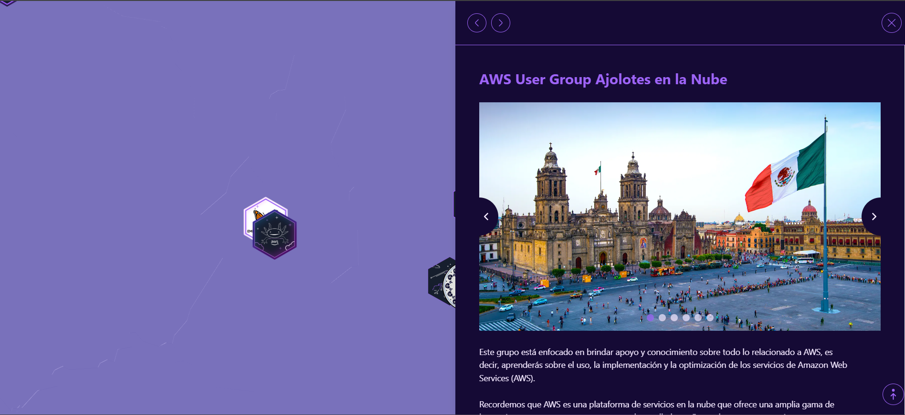

# User Group Map Template (React + Vite)

This project is a template for creating a map of technology user groups for your country or region. It's built with React and Vite, and uses Leaflet for the interactive map. The goal is to provide a minimal and easy-to-customize base so you can quickly launch a map for your own community.

## Final Result

An example of what you can build!



## How to Customize for Your Country

To adapt this map to your country and your communities, you just need to edit one main file.

**1. Modify the group data:**

Open the `src/data/locations.js` file. You will find an array of objects, where each object represents a marker on the map.

Simply edit, add, or remove objects in this array. The structure for each group is as follows:

```javascript
// filepath: src/data/locations.js
// ...
  {
    name: "User Group Name",
    city: "City",
    url: "https://group-url.com",
    img: "group-logo.png", // Optional: Place the image in /public/logos/
    coordinates: [latitude, longitude] // Example: [40.4168, -3.7038]
  },
// ...
```

**2. Adjust the initial map view:**

In the main map component (likely `src/App.jsx` or `src/components/Map.jsx`), you can change the initial center and zoom level to fit your country.

Look for the `MapContainer` component's configuration and adjust the `center` and `zoom` values.

```jsx
// Example in a file like src/App.jsx
<MapContainer center={[40.4168, -3.7038]} zoom={6} ...>
  {/* ... */}
</MapContainer>
```

## Getting Started (For Development)

Follow these steps to run the project on your local machine.

1.  **Install dependencies:**
    Open a terminal and run the following command.
    ```bash
    npm install
    ```

2.  **Run the development server:**
    This will start the project in development mode.
    ```bash
    npm run dev
    ```
    Open your browser and navigate to the local URL shown in the terminal (usually `http://localhost:5173`).

---
---

# Plantilla para Mapa de Grupos de Usuarios (React + Vite)

Este proyecto es una plantilla para crear un mapa de grupos de usuarios de tecnología para tu país o región. Está construido con React y Vite, y utiliza Leaflet para el mapa interactivo. El objetivo es proporcionar una base mínima y fácil de personalizar para que puedas lanzar rápidamente un mapa para tu propia comunidad.

## Resultado Final

¡Un ejemplo de lo que puedes construir!


## Cómo Empezar (Para Desarrollo)

Sigue estos pasos para ejecutar el proyecto en tu máquina local.

1.  **Instalar dependencias:**
    Abre una terminal y ejecuta el siguiente comando.
    ```bash
    npm install
    ```

2.  **Ejecutar el servidor de desarrollo:**
    Esto iniciará el proyecto en modo de desarrollo.
    ```bash
    npm run dev
    ```
    Abre tu navegador y navega a la URL local que se muestra en la terminal (normalmente `http://localhost:5173`).

## Cómo Personalizar para tu País

Para adaptar este mapa a tu país y tus comunidades, solo necesitas editar un archivo principal.

**1. Modifica los datos de los grupos:**

Abre el archivo `src/data/locations.js`. Encontrarás un array de objetos, donde cada objeto representa un marcador en el mapa.

Simplemente edita, agrega o elimina objetos en este array. La estructura de cada grupo es la siguiente:

```javascript
// filepath: src/data/locations.js
// ...
  {
    name: "Nombre del User Group",
    city: "Ciudad",
    url: "https://url-del-grupo.com",
    img: "logo-del-grupo.png", // Opcional: Coloca la imagen en /public/logos/
    coordinates: [latitud, longitud] // Ejemplo: [19.4326, -99.1332]
  },
// ...
```

**2. Ajusta la vista inicial del mapa:**

En el componente principal del mapa (probablemente `src/App.jsx` o `src/components/Map.jsx`), puedes cambiar el centro inicial y el nivel de zoom para que se ajuste a tu país.

Busca la configuración del componente `MapContainer` y ajusta los valores de `center` y `zoom`.

```jsx
// Ejemplo en un archivo como src/App.jsx
<MapContainer center={[23.6345, -102.5528]} zoom={5} ...>
  {/* ... */}
</MapContainer>
```

---

### Información Original de la Plantilla Vite

This template provides a minimal setup to get React working in Vite with HMR and some ESLint rules.

Currently, two official plugins are available:

- [@vitejs/plugin-react](https://github.com/vitejs/vite-plugin-react/blob/main/packages/plugin-react/README.md) uses [Babel](https://babeljs.io/) for Fast Refresh
- [@vitejs/plugin-react-swc](https://github.com/vitejs/vite-plugin-react-swc) uses [SWC](https://swc.rs/) for Fast Refresh

If you are developing a production application, we recommend using TypeScript and enable type-aware lint rules. Check out the [TS template](https://github.com/vitejs/vite/tree/main/packages/create-vite/template-react-ts) to integrate TypeScript and [`typescript-eslint`](https://typescript-eslint.io) in your project.
